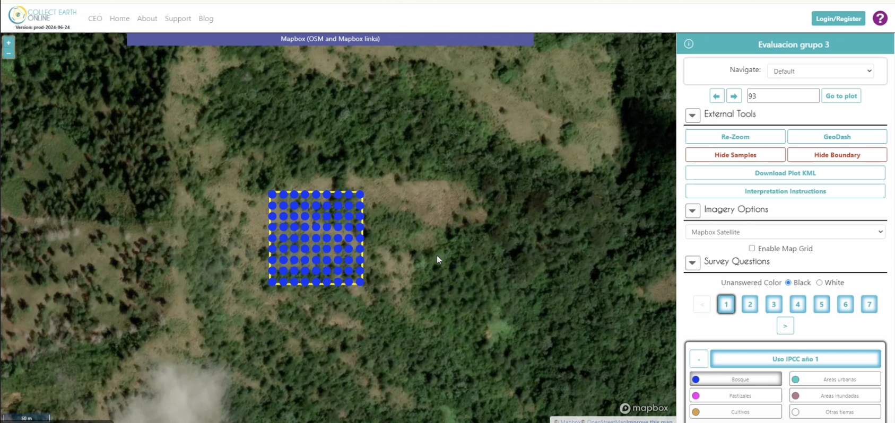

Notes  
### Week 6, Friday
### 09_27_24

Overview: 
GeoData Collection  
- Discuss how to collect data from 
  - Collect Earth Online (CEO)
  - Google Earth Engine (GEE)
  
 
Resources: 
[Collect Earth Online (CEO)](https://www.collect.earth/)   
[Google Earth Engine](https://earthengine.google.com/)  

What CEO used for?:   
**GeoData collection**  
Collect Earth Online is a platform used primarily for collecting, analyzing, and managing data related to land use, land cover, and environmental changes. 
Very useful for us focusing on forest monitering. 

more info:  
CEO facilitates the use of remote sensing and ground-truthing data to enhance decision-making and reporting rpocess. 

