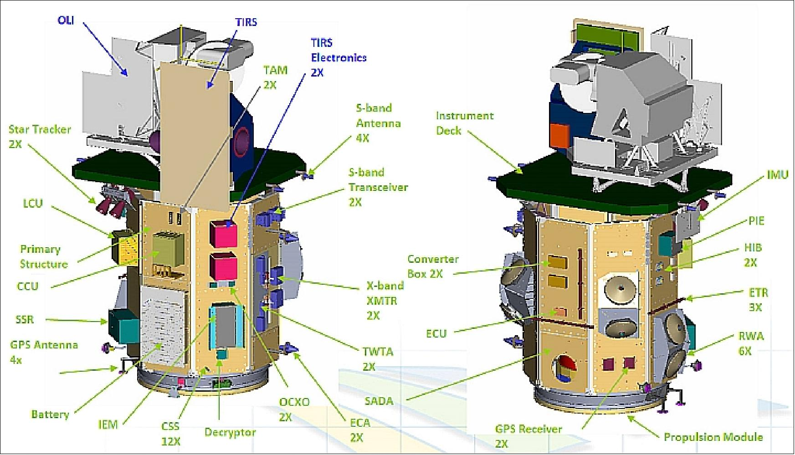
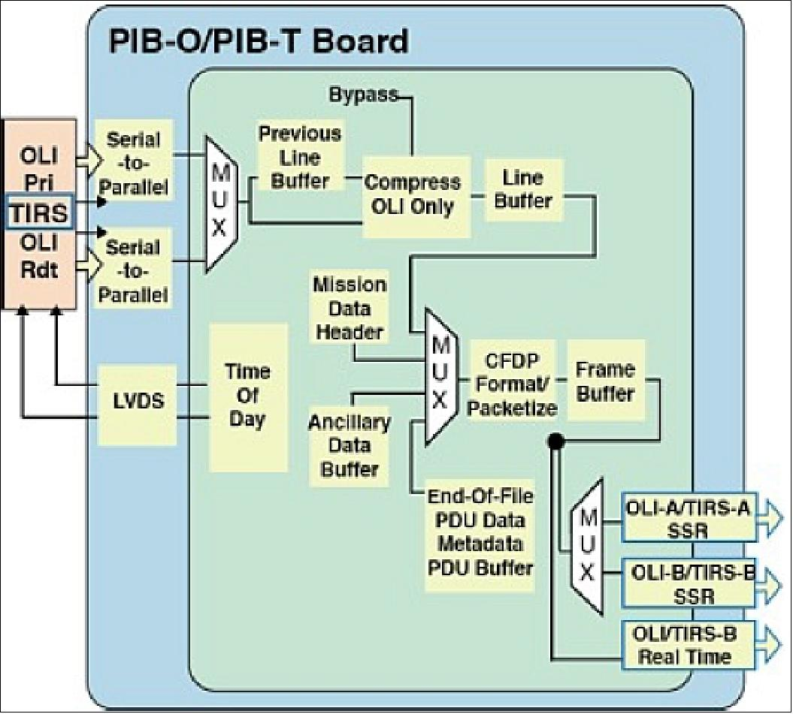
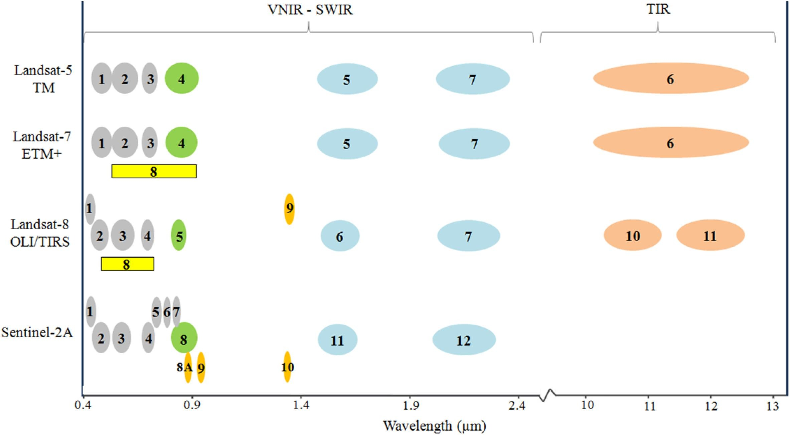

Jacqueline Sanchez  
October 24, 2024

# Landsat 8 

**Quick facts**:  
- Landsat 8 was launched February 11, 2013 

- Landsat 8 was first in the Landsat series to provide near real-time data **access to the public** upon its launch

- distinct from its predecessors due to its Enhanced Thematic Mapper Plus (ETM+) and **Operational Land Imager (OLI)** sensors

## Landsat 8 Architecture

The Landsat Data Continuity Mission (LDCM) spacecraft is the satellite that eventually became Landsat 8.
Landsat 8 has aboard two instruments. 

1. **OLI (Operational Land Imager)**:  
captures: images in the visible, **near-infrared**, and **shortwave infrared** portions of the electromagnetic spectrum  
enables:  detailed observations of the Earth's surface, such as vegetation, water bodies, and urban areas.

2. **TIRS (Thermal Infrared Sensor)**:  
detects: **thermal infrared radiation**, which is used to measure surface temperatures. 
useful: for studying land surface temperature, water resource management, and other thermal-related phenomena.

## More about its architecture 

## Landsat 8 Layers

**Citation/Credit:**  
Landsat 8 Architecture Images : 
Earth Observation Portal. (n.d.). Landsat 8 (LDCM). Retrieved October 24, 2024, 
from https://www.eoportal.org/satellite-missions/landsat-8-ldcm#spacecraft

Zakaria Adiri, Rachid Lhissou, Abderrazak El Harti, Amine Jellouli, Mohcine Chakouri, Recent  
advances in the use of public domain satellite imagery for mineral exploration: A review of Landsat-8  
and Sentinel-2 applications, Ore Geology Reviews, Vol. 117, 2020, Article 103332, https://doi.org/10.1016/j.oregeorev.2020.103332.

Enhanced Thematic Mapper Plus (ETM+)

