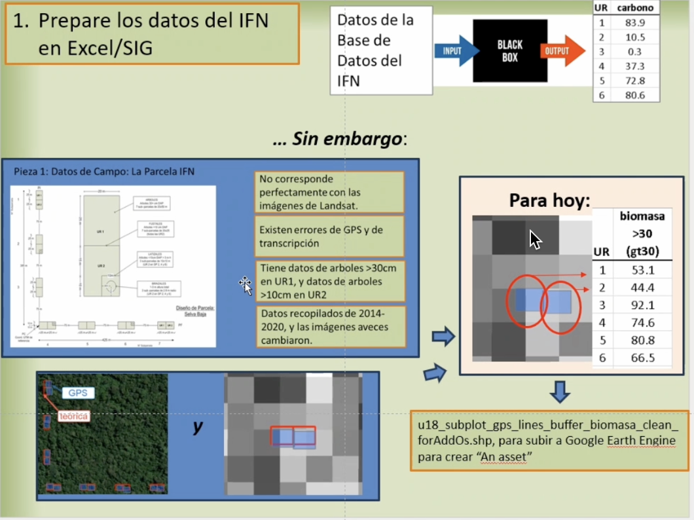
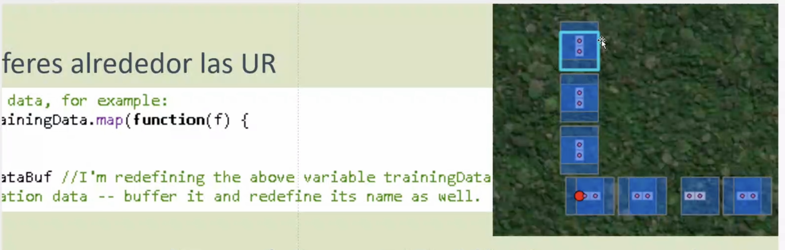

### Week 6, Monday
### 09_23_24
## Overview:  
we discussed over these topics 
- Preparing data from IFNs (Inferred Feature Networks)
- PCA 
- Buffers
- Concept: Black box
- Landsat Imagery

## Preparing data from IFNs 

In this example  it demonstrates how to prepare the data from an IFN in Excel.

The data is extracted from a IFN database which is the process into a "black box". A 
`black box` refers to the stage where raw data is transformed into insights through complex algorithms or processes that are not fully transparent to the user.

 So one of our goals is to bring transparency to the data analysis processes by understanding the algorithms that go behind transforming the data. 

## PCA (Principal Component Principals)
**PCA** is a dimensionality reduction technique used in data preprocessing and exploratory data analysis. 

PCA transforms data into a new set of components that capture the most variance in the dataset. By combining the original features into these principal components, PCA reduces the dimensionality of large datasets while preserving as much information as possible

## Buffer:
A buffer creates a zone around a geographic feature to analyze spatial relationships and proximity effects.

## Buffers in Geospatial Analysis
**(a) Definition**: 
A `buffer` refers to a zone or area created around a specific geographic feature, such as a point, line, or polygon. The buffer is typically defined by a specified distance and is used to analyze spatial relationships or proximity.

 **(b) Purpose**  
Assess proximity to resources (e.g., population near parks).
Evaluate environmental impacts (e.g., areas near pollution sources).

**(c) Interpretation of Land**: 
Buffers facilitate the analysis of land use and environmental conditions within the designated zone.

## Pixels and Landsat
### Pixels:

Remote sensing images (like those from Landsat) are composed of pixels, each representing a specific area on the ground.
Each pixel contains data about that area (e.g., reflectance values). 
### Landsat Imagery:

Captures images of the Earth's surface, producing pixel-based data on land cover.

### How do they relate to buffers?:
Buffers can be applied to analyze pixel data, helping identify patterns within specific distances from features (e.g., land cover changes around a specific location).

### Summary
Buffers assist in analyzing spatial relationships and interpreting land characteristics!
Pixels are the fundamental units of Landsat imagery, and they can be analyzed with buffers for deeper insights into environmental and spatial patterns.